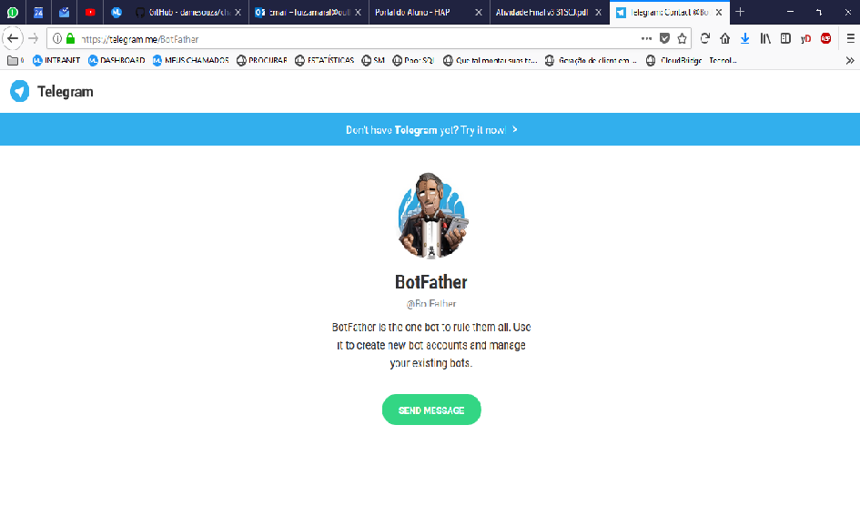

# chatbot-fiap-telegram
Projeto de Pos Fiap 

Agosto de 2018.
FIAP

# Objetivo

O objetivo desta atividade é criar um bot Telegram que simule um banco virtual, e seja
possível implementar os comportamentos basicos de um banco virtual como depositar,sacar,abrir conta,etc...

# 1. Introdução
	
Com o avanço da tecnologia móvel no mundo inteiro, explorando, dentre outras formas pelos comunicadores instantâneos aliado aos assistentes virtuais que tem se mostrado cada vez mais inteligentes e ajudando as pessoas a cumprirem suas tarefas do cotidiano estabelecendo uma plataforma de serviços de autoatendimento, com possibilidades também abertas as empresas.

Os bancos financeiros, por sua vez, estão nascendo ou migrando para a realidade digital, onde não é obrigatório ter agências físicas para obter seus principais serviços. Com o acesso massificado da internet, é possível realizar desde a abertura da conta e transações de qualquer natureza remotamente.

Por outro lado, os bots, abreviação de robots, tem sido utilizado nos principais comunicadores de mensagens, como o Telegram e Facebook. Sua facilidade e flexibilidade de integração permite utilizá-los como assistentes pessoais para resolução de diversas questões, tais como: 
Obter segunda via de contas, solicitação de serviços e solicitação de informações. Os bots substituem o atendimento humano pelo virtual, mais efetivo e, podendo ser explorado para ser adaptado a cada tipo de cliente.

# 2. Componentes e Frameworks

# Maven
O Maven é uma ferramenta para gerenciamento das bibliotecas e plug-ins de
um ou mais repositórios de forma dinâmica utilizando um XML para descrever o
projeto de software sendo construído.

#Java API for Telegram
O Java API for Telegram possibilita o desenvolvimento de um bot personalizado conforme a necessidade do projeto.
Website da API:
[https://oss.sonatype.org/content/repositories/releases/com/github/pengrad/java-telegram-bot-api/2.1.2/](https://oss.sonatype.org/content/repositories/releases/com/github/pengrad/java-telegram-bot-api/2.1.2/)
# Prevlayer
Api de persistência usado para persistir os dados do usuário/cliente em arquivo conforme documento de requisitos.

[http://prevlayer.org/](http://prevlayer.org/)

[https://mvnrepository.com/artifact/org.prevayler](https://mvnrepository.com/artifact/org.prevayler)

# Java Logging
Ferramenta padrão de log do java em Console.

[https://docs.oracle.com/javase/7/docs/api/java/util/logging/package-summary.html](https://docs.oracle.com/javase/7/docs/api/java/util/logging/package-summary.html)

# 3. Estrutura de pacotes do Projeto

 
 
 fiap.telegram
 - Pacote principal com os arquivos do projeto.

 fiap.telegram.bot
 - Pacote com a inteligência do Bot para buscar as mensagens do telegram.

 fiap.telegram.command
 - Pacote com todas as classes de comandos a serem executados.

 fiap.telegram.comparator
 - Pacote com o comparator de cliente.

 fiap.telegram.constants
 - Pacote de constantes

 fiap.telegram.manager
 - Pacote com os gerenciados de envio de mensagens ao telegram e gerenciamento da sessão do cliente.

 fiap.telegram.model
 - Pacote com a camada model

 fiap.telegram.prevayler
 - Pacote prevlayer de persistência em arquivo.

 fiap.telegram.utils
 - Pacote de Utilidades

# 4. Pré-requisitos
 - Tecnologias necessárias.
 
    1- Para executar o projeto é necessário ter o JRE 8 ou JDK 8 instalado.
 
    2- Utilizar uma ide para execução. (Eclipse é recomendado)
 
 - Dados do Bot

 
 
# 5. Utilização do Bot

- Funcionalidades

 - Para Utilização do bot, enviar o comando /start para o bot com o nome @sheldonfiap_bot.
 - Tela de boas-vindas do banco
 - Criação de conta
 - Modificação de conta
 - Inclusão de dependentes (conta-conjunta)
 - Exibição dos dados do titular e dependentes
 - Depósito
 - Saque (custo do serviço R$ 2,50)
 - Solicitação de extrato (custo do serviço R$ 1,00)
 - Solicitação de empréstimo, cujo prazo máximo é de 3 anos e valor máximo é de 40 vezes o saldo da conta (custo do serviço R$ 15,00 além de juros de 5% a.m.)
 - Exibição de saldo devedor do empréstimo e prazo de pagamento
 - Exibição dos lançamentos detalhada, com somatória ao final
 - Exibição das retiradas, com somatória ao final
 - Exibição das tarifas de serviço, com somatória ao final dos serviços que já foram utilizados na conta
 - Tela de ajuda
 
 Lista de comandos conforme imagem abaixo.
 
 - 

 - Utilizando um bot novo(opcional)
 
 Para o desenvolvimento do Bot, é necessário solicitar um token para o 
 @BotFather, um bot do próprio Telegram para criação e gestão dos Bots. 

A solicitação é feita através do endereço [Acesse aqui](https://telegram.me/BotFather) mostrado a seguir.

 

# 6. Resumo técnico de funcionamento

A partir da classe Bot recuperamos as mensagens represadas da API do Telegram, verificamos se o cliente já está salvo através da classe SessionManager que por sua vez,
 verifica e grava um cliente através da camada de Prevayler.

Na camada de command, instanciamos um comando através da CommandFactory, que verifica se o comando 

vindo através da digitação do usuário é válido, ou seja, se está listado no Enum de comandos ComandoEnum e o instância para ser executado. 
 	
Cada comando corresponde a uma funcionalidade do sistema, verificando em qual etapa o

 cliente está, devolve uma informação para a Interface Comando e grava o estado a cada interação com o usuário, no final, 
 retorna as opções de menu principal para a API do Telegram e devolve o resultado para o usuário.

# Diagramas de Classe

 
 
# Diagrama de Sequência
 
 
 
 
# Executando o projeto

No diretório **src** no pacote **br.fiap.telegram** existe um arquivo chamado **Main.java** . Abra esse arquivo e execute **Run**

 
# Javadoc

[Acesse clicando aqui](docs/javadoc/index.html)

# Referências

- Telegram Documentação oficial

  [https://core.telegram.org/bots](https://core.telegram.org/bots)
  	
  [https://core.telegram.org/bots/api](https://core.telegram.org/bots/api)

 
